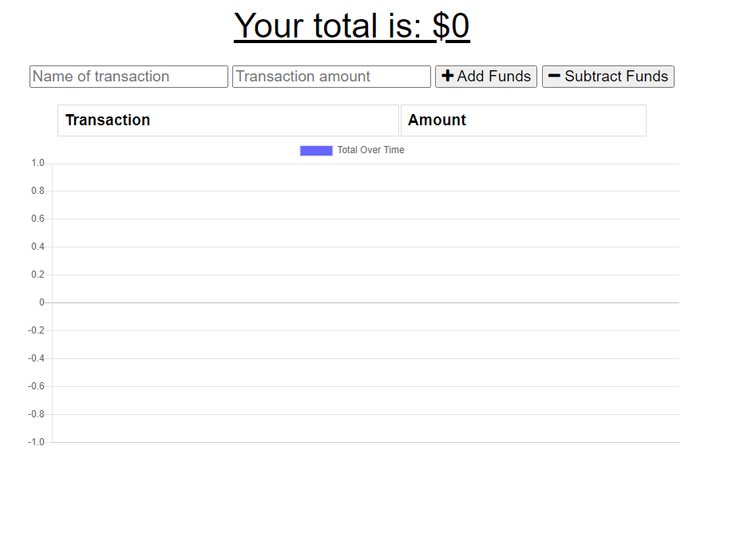

# BudgetTracker-PWA

A budget tracker progressive web app. Uses IndexedDB for offline functionality.

**Deployed Application:** https://morning-sierra-51260.herokuapp.com/

## Tech

- NodeJS
- Mongoose
- ExpressJS
- Webpack

## Installation

- Run `npm i` to install dependencies
- Run `npm run build` to build with webpack
- Run `npm start` to start server

## Usage Notes

You can install this application from your web browser on desktop or a mobile device that supports PWAs. Simply select "Add to Home Screen" or "Install" on your web browser!

## Preview

